# Tiger Analytics — Store Pricing Feed Management System

A high-performance, single-page React Native application designed to import, query, modify, and audit store pricing feeds offline-first. Bootstrapped with React Native v0.85.3 (New Architecture) and fully optimized for large network scales (3,000+ stores).


## 📱 Application Demo / Screen Recording

Below is a screen recording walkthrough showcasing the multithreaded CSV import, interactive line-by-line validations, dynamic country filter badges, pagination, and the database audit trails for manual adjustments:

[▶ Play the Application Demo Video (demo.webm)](./demo.webm)

---

## 1. Environment Setup & Configuration Setup

### Prerequisites
Before running the application, make sure you have the following setup on your system:
- **Node.js**: Version 18 or newer.
- **Android SDK & Build Tools**: Set up for Android development (Android Studio, emulator configured).
- **macOS / Xcode** (Optional): For running the iOS platform client (requires Cocoapods installed).

### Step 1: Install Dependencies
Ensure you are in the workspace root directory and install npm packages:
```sh
npm install
```

### Step 2: Start the Metro Bundler
Start the Metro JavaScript build server:
```sh
npm start
```

### Step 3: Compile and Run the App
With the Metro server running, open a new terminal window and run the platform target:

#### For Android (Emulator or Connected Device)
Ensure your AVD emulator is active:
```sh
npm run android
```

#### For iOS (macOS only)
First, install iOS CocoaPods dependencies:
```sh
bundle install
bundle exec pod install
```
Then run the iOS compiler client:
```sh
npm run ios
```

### Step 4: Run the Jest Test Suite
Verify parser validations and storage lookup indices are fully operational:
```sh
npm test
```

---

## 2. System Context Diagram

The following context diagram illustrates how the offline-first React Native application interacts with store operators, local device files, and the central retail enterprise database (ERP).

```mermaid
graph TD
    StoreManager["Store Manager / User"] -- "Imports CSV & Edits Prices" --> App["React Native Client App"]
    LocalFiles["Local Device Files"] -- "Read CSV Feed" --> App
    
    subgraph ClientBoundary ["Client Boundary (Offline-First)"]
        App --> Storage["Storage Service Interface"]
        Storage --> IndexEngine["In-Memory Index Manager"]
        Storage --> LocalDB["Local Persistence Engine JSON/SQLite"]
    end
    
    subgraph CorporateNetwork ["Corporate Network (Online Sync)"]
        App -- "Sync / Conflicts Reconciled" --> SyncAPI["Central Sync API Gateway"]
        SyncAPI --> ERP["Central Retail ERP Database"]
        ERP --> Analytics["Business Intelligence & Analytics"]
    end
    
    classDef boundary fill:#1e293b,stroke:#3b82f6,stroke-width:2px;
    class ClientBoundary,CorporateNetwork boundary;
```



---

## 3. Solution Architecture

The client-side solution is structured into three decoupled layers:

```
┌─────────────────────────────────────────────────────────────────┐
│                    1. Presentation Layer (UI)                   │
│  [App.tsx] ── [StatsDashboard] ── [CSVImporter] ── [EditModal]   │
└────────────────────────────────┬────────────────────────────────┘
                                 │
                                 ▼
┌─────────────────────────────────────────────────────────────────┐
│                       2. Core Logic Layer                       │
│       [csvParser.ts] (Asynchronous Batch Chunk Processing)      │
└────────────────────────────────┬────────────────────────────────┘
                                 │
                                 ▼
┌─────────────────────────────────────────────────────────────────┐
│                 3. Storage & Data Access Layer                  │
│  [StorageService.ts] ── [IndexManager.ts] ── [StoreMetadata.ts]  │
└─────────────────────────────────────────────────────────────────┘
```

### Module Breakdown:
1. **Presentation Layer (UI)**:
   - **Main View (`App.tsx`)**: Orchestrates state, safe-area layout, coordinates pagination, and links modals.
   - **Metrics Dashboard (`StatsDashboard.tsx`)**: Renders a compact, single-row global statistics overview (Pricing Records, Active Stores, Catalog SKUs, and 24h modifications count).
   - **CSV Importer (`CSVImporter.tsx`)**: Integrates document picker triggers and displays line-by-line validation reports.
   - **Fuzzy Search Engine (`SearchFilters.tsx`)**: Provides range boundary inputs, country badges, sorting triggers, and hooks search text to the index search query.
   - **Record Card Renderer (`RecordCard.tsx`)**: Displays specific records formatted with their store's localized currency symbol (e.g. `£` for UK, `¥` for JP).
   - **Modal Form Editor (`EditModal.tsx`)**: Houses the edit inputs and the timeline UI representing historical adjustments.

2. **Core Logic Layer**:
   - **CSV Processor (`csvParser.ts`)**: Parses text feeds into memory. Uses a non-blocking **Asynchronous Batch Processor** that processes CSV lines in batches of 200, yielding loop ticks to the JS engine via `setTimeout` to maintain 60 FPS performance on low-spec mobile chips.

3. **Storage & Data Access Layer**:
   - **Index Manager (`IndexManager.ts`)**: Maintains token indices for SKU prefixes and product name words to handle queries without scanning full arrays.
   - **Store Metadata (`StoreMetadata.ts`)**: Hosts store profile properties and handles rich country-specific mappings (resolving queries by Country Code, Name, City, or Currency symbol).
   - **Storage Service (`StorageService.ts`)**: Handles local database CRUD, de-duplication rules (newer records overwrite older ones), and persists changes back to local disk.

---

## 4. Design Decisions

| Decision | Selected Approach | Rationale / Benefits |
| :--- | :--- | :--- |
| **Local Database Engine** | JSON-based storage + In-Memory Index Maps | Prevents native binary linker complications (e.g. SQLite compile linkage stutters) when testing on target emulators while maintaining fully modeled database behavior. Easily maps to SQLite for production. |
| **CSV Parser** | Custom, zero-dependency parser | Ensures 100% compliance with React Native bundlers. Correctly resolves nested quotes, escaped tokens, and Unix/DOS carriage returns. |
| **Import Processing** | Asynchronous batch chunking | Processing large files blocks the single JavaScript thread. Chunking by 200 rows ensures frame rates remain high. |
| **Conflict Management** | Feed Date + Incremental Versioning | When duplicate Store+SKU records are imported, the system inspects the incoming file date. Only equal or newer dates overwrite values, avoiding stale data updates. |
| **Stable Audit Sort** | Double-key index sorting | If multiple pricing adjustments are recorded within the same millisecond, the system sorts by timestamp and falls back to array index position, ensuring deterministic history. |
| **Default List Sorting** | SKU Ascending | The pricing list defaults to alphabetical sort order on `SKU` column for clean scannability. |

---

## 5. Non-Functional Requirements (NFR) Analysis

Operating a retail chain with **3,000 stores across multiple countries** introduces unique constraints. The design addresses these as follows:

* **Performance & High Data Volume**: 
  - **Indexed Lookups**: Search runs queries against the `IndexManager` token maps instead of scanning the full table array ($O(1)$ instead of $O(N)$).
  - **Virtualized Rendering**: The records list uses `FlatList` with optimized props (`windowSize={5}`, `removeClippedSubviews=true`, `initialNumToRender={10}`) to ensure off-screen cards are unmounted, saving RAM.
  - **Pagination**: Splitting query outputs into 10-row pages reduces rendering overhead.
* **Offline-First Operations**: 
  - All imports and updates occur directly in the local storage engine. When the network is down, the system queues audit log operations. When online, the sync protocol pushes changes back to the ERP gateway.
* **Data Integrity & Validation**:
  - The custom parser enforces strict schema boundaries: Store ID and SKU must be alphanumeric; prices must be non-negative; dates must be in a valid `YYYY-MM-DD` format.
  - The UI generates detailed row line reports showing validation failures without aborting the entire batch.
* **Multi-Currency & Localization**:
  - The `StorageService` matches Store IDs to country profiles, dynamically formatting price labels (e.g. `STORE_UK` formats as `£X.XX`, `STORE_JP` as `¥X`).
* **Compliance & Auditability**:
  - Every manual edit or bulk import change creates an immutable `AuditLogEntry`, recording what field changed, old vs. new values, the user role, and exact timestamps.

---

## 6. System Assumptions

1. **Store ID Mapping**: It is assumed Store IDs contain country indicators (e.g., `STORE_US`) or are matched to metadata records containing currency types.
2. **Device Capacity**: The local device has sufficient flash storage (typically $< 50\text{MB}$ for standard store databases) to persist records.
3. **Roles**: Standard application users are partitioned into Roles (e.g. "Store Manager") who have permission to edit records, whereas normal staff have read-only access.

---

## 7. Source Code Directory

The core source files implementing this architecture are:
* **Entry Point**: [App.tsx](file:///Users/vibhanshu/Documents/development/Test/TigerAnalyticsCaseStudy/App.tsx)
* **Data Interfaces**: [src/types.ts](file:///Users/vibhanshu/Documents/development/Test/TigerAnalyticsCaseStudy/src/types.ts)
* **Database & Persistence**: [src/database/StorageService.ts](file:///Users/vibhanshu/Documents/development/Test/TigerAnalyticsCaseStudy/src/database/StorageService.ts)
* **Fuzzy Index Engine**: [src/database/IndexManager.ts](file:///Users/vibhanshu/Documents/development/Test/TigerAnalyticsCaseStudy/src/database/IndexManager.ts)
* **Store Country Profiles**: [src/database/StoreMetadata.ts](file:///Users/vibhanshu/Documents/development/Test/TigerAnalyticsCaseStudy/src/database/StoreMetadata.ts)
* **Asynchronous Parser**: [src/utils/csvParser.ts](file:///Users/vibhanshu/Documents/development/Test/TigerAnalyticsCaseStudy/src/utils/csvParser.ts)
* **UI Components**:
  - [src/components/StatsDashboard.tsx](file:///Users/vibhanshu/Documents/development/Test/TigerAnalyticsCaseStudy/src/components/StatsDashboard.tsx)
  - [src/components/CSVImporter.tsx](file:///Users/vibhanshu/Documents/development/Test/TigerAnalyticsCaseStudy/src/components/CSVImporter.tsx)
  - [src/components/SearchFilters.tsx](file:///Users/vibhanshu/Documents/development/Test/TigerAnalyticsCaseStudy/src/components/SearchFilters.tsx)
  - [src/components/RecordCard.tsx](file:///Users/vibhanshu/Documents/development/Test/TigerAnalyticsCaseStudy/src/components/RecordCard.tsx)
  - [src/components/EditModal.tsx](file:///Users/vibhanshu/Documents/development/Test/TigerAnalyticsCaseStudy/src/components/EditModal.tsx)
